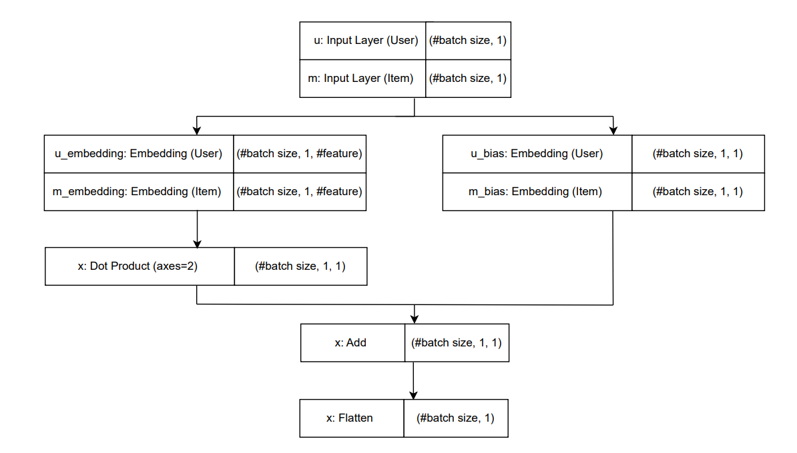
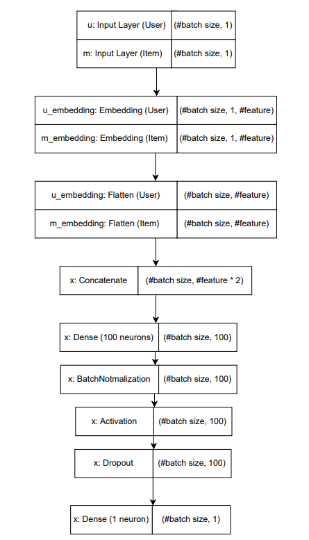
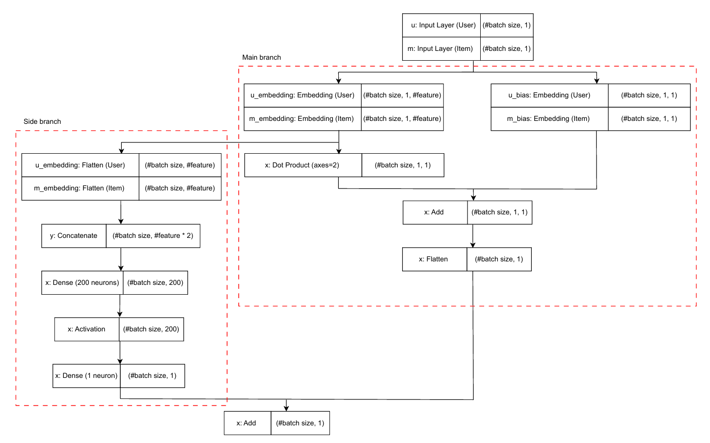

# Deep Learning Based Recommender System
This notebook is to learn about how deep learning approaches are used in recommender models. 

Courtesy of the learning materials by @lazyprogrammer and @Chinmayrane16, this notebook is referenced from the content of the following repositories:
- https://github.com/lazyprogrammer/machine_learning_examples/tree/master/recommenders

- https://github.com/Chinmayrane16/Recommender-Systems-with-Collaborative-Filtering-and-Deep-Learning-Techniques/tree/master

### Notebook Breakdown
- Collaborative Filtering using Embedding (Keras)
- Neural Collaborative Filtering (NCF)
- Residual Learning / Hybrid Model

## Collaborative Filtering using Embedding (Keras)

**Architecture Overview**\
This architecture is a simple one which does not involve dense layer and activation function for more complex feature extractions. It only works as a matrix factorisation model implemented with neural network layers (embeddings).

1. **Input layers**\
The respective input layers takes in user ID and product ID.

    > Input shape: (#batch size, 1)\
    > Output shape: (#batch size, 1)
    

2. **Embedding layers**\
Let K be the number of features,each user and product is mapped to a dense vector of size K. These embeddings would represent the latent features of user and product.

    > Input shape: (#batch size, 1)\
    > Output shape: (#batch size, 1, K)

3. **Bias embedding layers**\
The respective bias embedding layers help model to capture the average tendency of user and product.

    > Input shape: (#batch size, 1)\
    > Output shape: (#batch size, 1, 1)

4. **Dot product**\
Computes the dot product between user and product embeddings and this is the predicted rating without bias.

    Based on the matrix factorisation approach in collaborative filtering, let approximate user matrix = $p_u$ and product matrix = $q_i$,
    $$\hat{r}_{ui} = p_u^T q_i$$

    > Input shape: [(#batch size, 1, K), (#batch size, 1, K)]\
    > Output shape: (#batch size, 1, 1)

5. **Add with bias**\
Biases are learnt for a final rating.
    $$\hat{r}_{ui} = \mu + b_u + b_i + p_u^T q_i$$
    Where:
    - $\mu$: Global average rating
    - $b_u$: Bias of user $u$ (how much higher/lower the user tends to rate)
    - $b_i$: Bias of item $i$ (how much more popular the item is)

    > Input shape: [(#batch size, 1, 1), (#batch size, 1, 1)]\
    > Output shape: (#batch size, 1, 1)

6. **Flatten**\
Reshapes the prediction to match the rating format.

    > Input shape: (#batch size, 1, 1)\
    > Output shape: (#batch size, 1)

## Neural Collaborative Filtering (NCF)
**Architecture Overview**

After the embedding layers, dense layers with activation function are added to the architecture to introduce non linear modeling. The model is no longer just dot products of latent vectors but learning complex and non-linear interactions between user and product features.

**Input layers**\
The respective input layers takes in user ID and product ID.
> Input shape: (#batch size, 1)\
> Output shape: (#batch size, 1)

**Embedding layers**\
Each user and product is mapped to a K-dimensional vector, where K is the number of latent features.
> Input shape: (#batch size, 1, K)\
> Output shape: (#batch size, 1, K)

**Flatten**\
The 1 dimension is flatten and the layers are reshaped.
> Input shape: (#batch size, K)\
> Output shape: (#batch size, K)

**Concatenate**\
The two embeddings are combined side-by-side.
> Input shape: [(#batch size, K), (#batch size, K)]\
> Output shape: (#batch size, 2K)

**Fully Connected Layers**\
Included dense, batchnormalization, activation and dropout layers. Among these, batchnormalization and dropout layers are optional. Activation function is omitted in linear dense layers since it is to introduce nonlinarity to the dense layer.

**Dense layer**\
Along with activation function, introduces non-linearity and lets the model learn high-order user-item interactions. The output shape is based on the number of nuerons/ hidden representation.

Some tips in choosing number of neurons:
- higher number of neurons: suitable for big size data, may have risk of overfitting on small dataset
- lower number of neurons: fewer parameters so faster generalization, but have risk of underfit (cannot learn rich intearations)
> Input shape: (#batch size, 2K)\
> Output shape: (#batch size, 100)

**Batch Normalization**\
Apply for training stability and improving training speed by normalizing the inputs to the layer.
> Input shape:(#batch size, 100)\
> Output shape: (#batch size, 100)

**Activation Function**\
Introduce nonlinearity to the dense layer.
> Input shape: (#batch size, 100)\
> Output shape: (#batch size, 100)

**Dropout**\
Dropout is applied for regularization and reducing overfitting. Since it will only revert part of the weight to zero, the output shape remains unchanged. Dropout layer is disabled during inferencing so that the full model capacity is utilised for predictions. 
> Input shape: (#batch size, 100)\
> Output shape: (#batch size, 100)

**Dense layer (linear)**\
No activation in this dense layer and it is a regression. It outputs a single predicted rating.
> Input shape: (#batch size, 100)\
> Output shape: (#batch size, 1)

### Residual Learning
**Architecture Overview**

This model architecture combines both matrix multiplication and neural collaborative filtering, making up a hybrid recommender model. The main branch learn the basic user–item interaction through latent dot products while the side branch capture nonlinear interactions between user and item latent features. In the end, the main prediction and residual correction from the neural network are added together so that the residual error from MF prediction can be compensate by neural network.

The model can also be customized into weighted hybrid model by assigning different weightage when doing the residual merge.

<pre>
Let alpha be the weightage,
<code>
final_output = Add()([alpha * dot_product_output, (1 - alpha) * dense_output])
</code>
</pre>